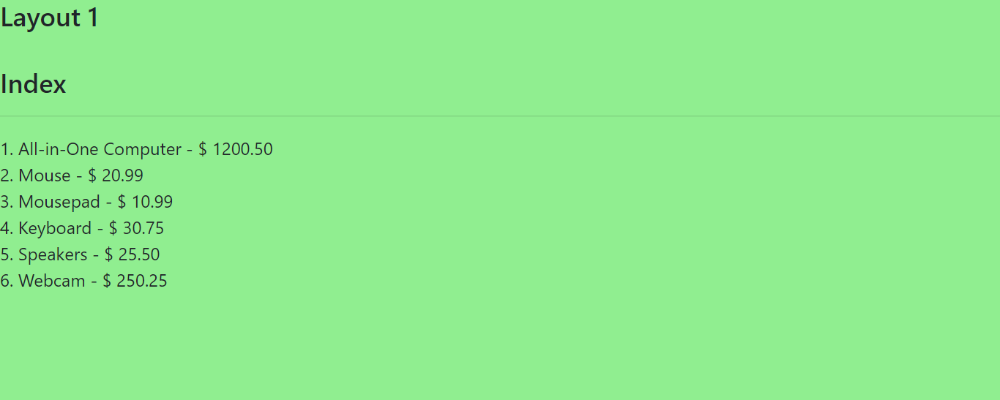
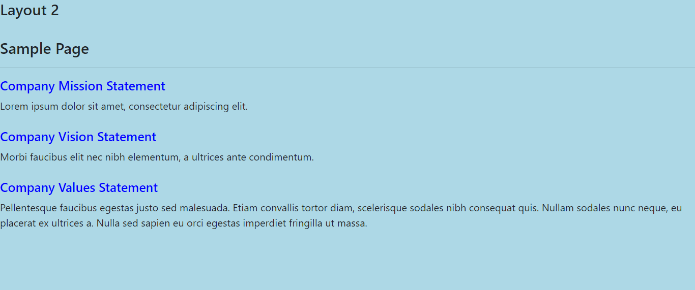

# MVC Framework

This project is a Model-View-Controller Framework from the MVC Architecture coded in PHP and designed in HTML, CSS and Bootstrap. A test database was coded in MySQL (MariaDB) to display some data through the MVC Framework. The home page is the ***/index*** route that
displays fictional product/price data stored in the test database, 
the ***/sample-page*** route displays fictional Company Mission/Vision/Values Statements, also retrieved from the test database. 

## Screenshot 1: ***/index***  route

## Screenshot 2: ***/sample-page*** route 

## Technology Stack

+ PHP
+ MySQL (MariaDB)
+ phpMyAdmin
+ XAMPP 
+ HTML
+ CSS
+ Bootstrap
